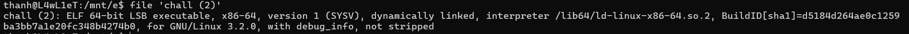

# Heap 0
-- Phân tích : hàm scanf để đọc dữ liệu đầu vào. Nếu chuỗi nhập vào lớn hơn kích thước của input_data thì có thể ghi đè lên các vùng nhớ khác.

-- Kiểm tra thông tin file : x86 64 bit, liên kết động

-- DEBUG : vùng nhớ của input_data là 0x5555555596b0, vùng nhớ của safe_var là 0x5555555596d0. In ra nội dung tại 2 vùng nhớ đó thì đúng là 2 chuỗi pico và bico. 

-- Vùng nhớ của input_data là 32 byte. Nhập input_data có kích thước 32 byte là đầy và byte thứ 33 sẽ tràn sang vùng nhớ của safe_var. Thử nhập input có kích thước là 33 byte (33 kí tự) để kiểm tra. 

-- Để lấy được flag thì giá trị tại vùng nhớ của safe_var != "bico". Chỉ cần kí tự thứ 33 đến 36 != "bico" là được.

# Heap 1
-- Phân tích : hàm scanf để đọc dữ liệu đầu vào. Nếu chuỗi nhập vào lớn hơn kích thước của input_data thì có thể ghi đè lên các vùng nhớ khác.

-- Kiểm tra thông tin file : x86 64 bit, liên kết động

-- DEBUG : vùng nhớ của input_data là 0x5555555596b0, vùng nhớ của safe_var là 0x5555555596d0. In ra nội dung tại 2 vùng nhớ đó thì đúng là 2 chuỗi pico và bico. 

-- Vùng nhớ của input_data là 32 byte. Nhập input_data có kích thước 32 byte là đầy và byte thứ 33 sẽ tràn sang vùng nhớ của safe_var. Thử nhập input có kích thước là 33 byte (33 kí tự) để kiểm tra. 

-- Để lấy được flag thì giá trị tại vùng nhớ của safe_var = "pico". payload : 32 byte + "pico" 

# Heap 2
-- Phân tích : hàm scanf để đọc dữ liệu đầu vào. Nếu chuỗi nhập vào lớn hơn kích thước của input_data thì có thể ghi đè lên các vùng nhớ khác.

-- Kiểm tra thông tin file: x86 64 bit, liên kết động

-- DEBUG : vùng nhớ của input_data là 0x00000000004056b0, vùng nhớ của x là 0x00000000004056d0. In ra nội dung tại 2 vùng nhớ đó thì đúng là 2 chuỗi pico và bico. 

-- Vùng nhớ của input_data là 32 byte. Nhập input_data có kích thước 32 byte là đầy và byte thứ 33 sẽ tràn sang vùng nhớ của x. 

# Heap 3
-- Phân tích : Sau khi `free(x)` con trỏ không được trả về NULL -> Có thể gây ra lỗi

-- Khi gọi hàm malloc với kích thước bằng với kích thước của vùng nhớ vừa được free thì bộ nhớ sẽ cấp phát lại vùng nhớ mới giải phóng trước đó.

-- Vì object có kích thước là 35 byte (10+10+10+5) -> byte từ 31 đến 34 cuối cùng là "pico" để nhận được flag

# Format-string-0
-- Phân tích : nằm ở `printf(choice2);`. Nếu choice2 chứa các ký tự định dạng như : %s, %p, %x,.. dẫn đến dữ liệu trong stack có thể bị leak. 

-- Tuy nhiên, trong chương trình này chỉ cần bị lỗi Segmentation Fault sẽ hiển thị flag. tạo pattern 50 byte. Nhận được flag 

# Format-string-1
-- Phân tích : nằm ở `printf(buf)`. Nếu choice2 chứa các ký tự định dạng như : %s, %p, %x,.. dẫn đến dữ liệu trong stack có thể bị leak. 

-- Vì flag và printf(buf) đều trong hàm main (flag trước printf) nên có thể Phân tích để xuất ra giá trị của flag trong stack.

-- Điền một loạt %p để xác định vị trí của flag. Vị trí thứ 14 thì xuất hiện phần đầu của flag 

-- Thử các vị trí từ 14 trở lên cho đến khi đến phần cuối của flag 

# Buffer-overflow-0
-- Phân tích : `gets(buf1)` và `strcpy(buf2, input);` không kiểm tra kích thước chuỗi đầu vào có thể dẫn đến lỗi buffer-overflow.

-- Để lấy được flag thì cần gây ra lỗi Segmentation Fault. Tạo chuỗi vượt quá kích thước buf2 để ghi đè lên các vùng nhớ khác để gây lỗi 

# Buffer-overflow-1
-- Phân tích : `gets(buf1)` không kiểm tra kích thước chuỗi đầu vào nên có thể gây ra lỗi buffer-overflow.

-- Tạo chuỗi với kích thước 100 byte để kiểm tra vị trí ghi đè lên địa chỉ trả về. Từ vị trí thứ 45 là ghi đè lên địa chỉ trả về

-- Tạo script để khai thác 

-- Để kết nối đến server, remote(host,port) thay vì process để lấy được flag

# Buffer-overflow-2
-- Phân tích : `gets(buf1)` không kiểm tra kích thước chuỗi đầu vào nên có thể gây ra lỗi buffer-overflow.

-- Tạo chuỗi với kích thước 200 byte để kiểm tra vị trí ghi đè lên địa chỉ trả về. Từ vị trí thứ 113 là ghi đè lên địa chỉ trả về. 

-- Thêm các chuỗi "AAAA", "BBBB","CCCC" để kiểm tra vị trí các tham số (vì file này là x86 32 bit). Byte thứ 117 đến 120 là tham số thứ nhất, 121 đến 124 là tham số thứ hai.

-- Gửi payload hoàn chỉnh và nhận flag 

-- Để kết nối đến server, remote(host,port) thay vì process để lấy được flag

# Clutter-overflow
-- Phân tích : `gets(clutter)` không kiểm tra kích thước chuỗi đầu vào nên có thể gây ra lỗi buffer-overflow.

-- clutter có kích thước là 0x100 tương đương 256 byte. Tạo chuỗi với kích thước 300 byte để kiểm tra vị trí ghi đè lên code. Từ vị trí 265 đến 272 là vùng nhớ của code.

-- Gửi payload hoàn chỉnh và nhận flag 

-- Để kết nối đến server, remote(host,port) thay vì process để lấy được flag

# Two sum
-- Phân tích : nếu kết quả khi thực hiện phép toán a+b vượt quá giá trị lớn nhất thì dẫn đến Integer Overflow

-- Vì a và b thuộc kiểu int (4 byte) nên số nguyên lớn nhất là 2^(32-1)-1. Để lấy được flag thì a và b đều lớn hơn 0 và kết quả của tổng phải bé hơn 0. Chọn a là số nguyên lớn nhất và b là 1 để kết quả của tổng vượt qua số nguyên lớn nhất dẫn đến overflow.

# RPS
-- Phân tích : hàm strstr tìm vị trí đầu tiên của chuỗi 1 (input) chứa chuỗi 2. Nếu như chuỗi 1 có chứa chuỗi 2 thì trả về con trỏ trỏ tới vị trí bắt đầu của chuỗi 1 khi chứa chuỗi 2. Từ đó, dẫn đến việc user có thể kiểm soát giá trị trả về của hàm strstr.

-- `if(strstr(player_turn, loses[computer_turn]))` so sánh lựa chọn user nhập vào với lựa chọn để thắng computer. Nếu lựa chọn của user chứa lựa chọn để thắng computer thì trả về con trỏ (khác NULL). Thỏa điều kiện if (win). Vậy chỉ cần nhập đầy đủ các lựa chọn thì kết quả sẽ luôn thắng. 

# Basic-file-exploit
-- Phân tích : hàm strtol nhận tham số đầu tiên là user_input để chuyển từ string sang long int. Vậy user có thể kiểm soát giá trị trả về của hàm strtol. 

-- `if((entry_number = strtol(entry, NULL, 10)) == 0)` so sánh kết quả trả về của hàm strtol và 0. Phân tích cú pháp hàm strtol :
+ Tham số 1 : chuỗi đầu vào sẽ chuyển sang long int
+ Tham số 2 : con trỏ trỏ tới một con trỏ chứa phần còn lại của chuỗi
+ Tham số 3 : cơ số chuyển đổi

-- Hàm strtol trả về 0 khi : 
+ Input bắt đầu bằng 0 và kí tự sau không phải là số 
+ Input bằng "0"

-- Để inputs khác bằng 0 thì thì phải chọn Type '1' rồi mới đến Type '2' và nhập entry

