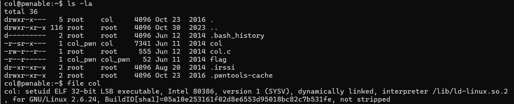
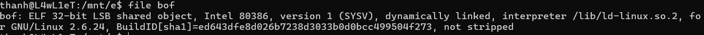
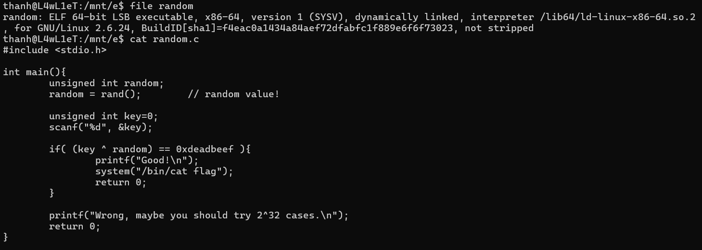
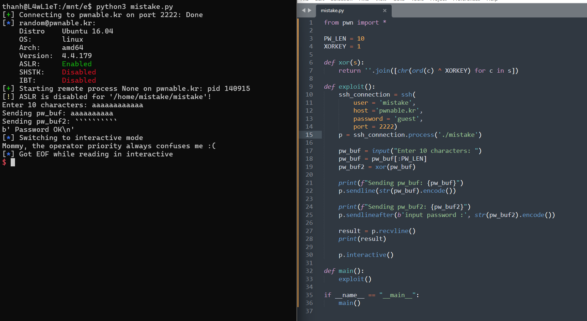
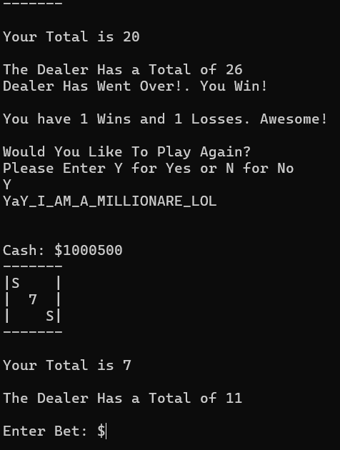
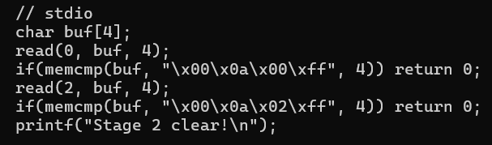

# fd
-- Liệt kê các file trong thư mục hiện tại -> Có 1 file là **flag** nhưng không thể đọc được vì cần có quyền user : **fd_pwn** hoặc group : **root**. Quan sát, file thực thi **fd** đã được setuid và chạy với quyền **fd_pwn** -> Có thể sử dụng **fd** (x86 32 bit) để đọc **flag** 
 

-- Sao chép fd và fd.c về local để phân tích. Đoạn `system("/bin/cat flag");` đọc flag nếu thỏa buf bằng  "LETMEWIN\n". Đoạn ` read(fd, buf, 32);`  nhận stdin và lưu vào buf nếu **fd = 0** . Từ việc nhận stdin từ bàn phím -> Kiểm soát được giá trị của buf. Để fd = 0 thì `atoi( argv[1] ) - 0x1234;` trả về 0. 
`0x1234` biểu diễn sang thập phân là `4660`. Hàm atoi chuyển phần đầu của chuỗi được trỏ tới thành số nguyên ( Ví dụ : "4660abc" sẽ thành 4460 )

-- Thử nghiệm trên local -> Đọc flag thành công

-- Thực hiện tương tự và nhận flag. Python script -> [fd.py](./script/fd.py)

# collision
-- Liệt kê các file trong thư mục hiện tại -> Có 1 file là **flag** nhưng không thể đọc được vì cần có quyền user : **col_pwn** hoặc group : **col_pwn**. Quan sát, file thực thi **col** đã được setuid và chạy với quyền **col_pwn** -> Có thể sử dụng **col** (x86 32 bit) để đọc **flag** 

-- Để thực hiện `system("/bin/cat flag");` thì kích thước argv[1] phải bằng **20 byte** và kết quả trả về của hàm **check_password** khi nhận argv[1] làm đối số bằng giá trị của **hashcode**. Phân tích hàm check_password : chuyển đổi mảng ký tự mà **p** đang trỏ tới thành mảng số nguyên và gán cho **ip**. Sau đó, trả về tổng các phần tử trong mảng số nguyên đó. 

-- Kích thước mảng số nguyên là 20 byte mà 1 phần chiếm 4 byte -> Tổng của 5 phần tử bằng giá trị của hashcode. Nếu truyền trực tiếp giá trị của hashcode + 16 NULL byte thì có thể dẫn đến các lỗi không mong muốn. Thay vào đó, chia ra các phần đều nhau để loại bỏ các NULL byte. Python script -> [col.py](./script/col.py)

# bof
-- Kiểm tra thông tin file **bof** : x86 32 bit

-- Để thực thi **/bin/sh** thì `key = 0xcafebabe`. Hàm gets đọc đầu vào từ bàn phím và lưu vào **overflowme**. Ban đầu, `key = 0xdeadbeef` và nằm trong stack ở địa chỉ cao hơn so với **overflowme** mà **gets** nhận đầu vào không giới hạn kích thước -> Có thể thao túng được giá trị của **key**.

-- Gửi 100 byte -> offset từ **save eip** đến **overflowme** là 48 và key nằm ở địa chỉ ebp + 0x8 (cách ebp 8 byte) -> Stack khi đó sẽ có dạng như sau : ... | key | save eip | save ebp | ... | overflowme -> Byte thứ 53 đến 56 là giá trị của key 

-- Thử nghiệm trên local -> Thành công

-- Gửi payload lên server -> Thành công. Python Script -> [bol.py](./script/bof.py)

# flag
-- Kiểm tra thông tin : x86 64 bit, liên kết tĩnh, không có phần section header -> Có vẻ như đã bị sửa đổi để che giấu thông tin

-- Sử dụng `strings flag` để hiển thị các chuỗi văn bản -> Tìm được thông tin : file này đã bị đóng gói bởi UPX

-- Install UPX -> Chọn option -d để giải nén ->  Check lại thông tin -> Unpacked thành công.

-- Xem mã hợp ngữ của hàm main : tìm thấy giá trị của **flag** được gán cho **rdx** ở dòng **main + 32**

-- Đọc nội dung của thanh ghi **rdx** sau khi được gán giá trị của **flag** -> Tìm thấy flag 

# random
-- Phân tích : chương trình này sử dụng hàm **rand** để sinh ra một số ngẫu nhiên trong đoạn từ 0 đến RAND_MAX. Tuy nhiên, kết quả trả về của hàm **rand** sẽ cố định vì không sử dụng **srand(seed)** để làm mới kết quả trả về của **rand()**

-- Kết quả trả về của hàm **rand** nằm trên **thanh ghi RAX** : 0x6b8b4567 . Tiếp theo, `xor 0x6b8b4567,0xdeadbeef` ra `0xb526fb88` hoặc `3039230856`

-- Python script -> [Random.py](./script/Random.py)

# mistake
-- Phân tích : Hàm xor được sử dụng để xor các phần tử của chuỗi với XORKEY. Chương trình cho nhập pw_buf và pw_buf2. Sau đó, lấy kết quả sau khi xor pw_buf2 so sánh với pw_buf. Ta có, **a xor b -> c** và **c xor b -> a** -> Giả sử : a (pw_buf) xor b (XORKEY) -> c (pw_buf2) thì c (pw_buf2) xor b (XORKEY)-> a (pw_buf) -> Khi input đầu tiên là pw_buf và khi nhập "input password :" là pw_buf2 sau khi xor với XORKEY (pw_buf) -> Thỏa điều kiện if

-- Python script -> [mistake.py](./script/mistake.py)

# shellshock 
-- Shellshock là lỗ hổng xảy ra trong **phiên bản 4.3** của Bash cho phép thực thi Bash command. Kiểm tra phiên bản của Bash : 4.2.25 -> Vẫn bị ảnh hưởng bởi Shellshock

-- Hàm setresuid và setresgid thay đổi quyền của tiến trình hiện tại thành groupID (shellshock_pwn) thông qua hàm getegid -> Sử dụng chương trình này để bash có quyền đọc flag

-- Bash có một cơ chế xử lý các hàm được truyền qua biến môi trường. Giả sử có 1 biến môi trường : `env x='() { :;}; /bin/cat flag' ./shellshock` ,  gồm các phần như sau : `x=() { :;};` (định nghĩa một hàm hợp lệ) , `/bin/cat flag` thêm os command, `./shellshock` (thực thi lệnh với môi trường được thiết lập tức thời)

# blackjack 
-- Phân tích : Có 3 options chính : 1. Bắt đầu game, 2. Xem luật chơi, 3. Thoát -> Option 2 và 3 thì không có gì đặc biệt -> Kiểm tra hàm play khi chọn option 1 : cash_test() - kiểm tra tiền trong ví ,  randcard() - Tạo card ngẫu nhiên , dealer() - hành động của dealer ,  betting() - đặt cược. Các hàm trên không có gì khả nghi ngoại trừ hàm betting : nếu số tiền đặt cược lớn hơn cash thì cho nhập lại hoặc nhỏ hơn, bằng đều trả về bet -> Có thể thao túng giá trị trả về của hàm betting. Tiếp tục kiểm tra hàm play : khi thắng thì `cash = cash + bet` và khi thua thì `cash = cash - bet`

-- Dựa vào logic xử lí của chương trình -> Có 2 hướng để khai thác :
+ bet (số dương lớn) > cash -> Đánh đến khi win -> `cash = cash + bet`(vì bet là số dương lớn nên khi win cash sẽ cộng thêm số dương lớn đó)

+ bet (số âm lớn) <= cash -> Đánh đến khi win -> `cash = cash - bet` (vì bet là số âm lớn nên khi lose cash sẽ cộng thêm số âm lớn đó)

# lotto 
-- Kiểm tra hàm play : chương trình đọc 6 byte và lưu vào **submit**, tạo 6 byte ngẫu nhiên và lưu vào **lotto**. Các phần tử trong **lotto** sẽ nằm trong đoạn từ 1 đến 45 trong bảng mã ASCII. Nếu 1 phần từ trong **lotto** trùng với 1 phần tử trong **submit** thì **match** tăng thêm 1 và đến khi match = 6 thì đọc flag -> Chỉ cần nhập 6 byte giống nhau thì khi phần tử nào đó trong **lotto** bằng với phần tử trong **submit** thì match sẽ bằng 6 nhanh nhất. 

-- Python script -> [lotto.py](./script/lotto.py)

# cmd1
-- Phân tích : chương trình thực thi hàm **system** nếu như kết quả trả về của hàm **filter** khi nhận argv[1] làm đối số là lớn hơn 0. Trong hàm filter, sử dụng hàm strstr để tìm các chuỗi con. Điều đặc biệt là khi truyền `whoam\i` thì strstr() xem `\` là 1 kí tự bình thường còn system() diễn giải kí tự `\` theo quy tắc của shell . Test -> [test.c](./script/cmd1.c)

-- Khai thác 

-- Ngoài ra thì sử dụng kí tự wildcard (*) cũng được

# cmd2
-- Trong phần 2, kí tự `/` đã được nằm trong filter nên không thể sử dụng `/bin/cat` như phần 1. 

-- Ý tưởng : sử dụng format trong printf để tạo ra lệnh `/bin/cat fla*`. Ban đầu, khi sử dụng hex thì có vẻ như chuỗi hex không diễn giải thành kí tự `/`

-- Tìm hiểu tài liệu -> Phát hiện ra khi sử dụng theo dạng octal thì kí tự `\057` được diễn giải thành `/`

# blukat
-- Phân tích : chương trình lấy **password** từ **/home/blukat/password** so sánh với **user_input**. Nếu bằng nhau thì in ra flag 

-- Tệp **password** bao gồm quyền user : **root** và group là **blukat_pwn**. Kiểm tra các quyền đang có hiện tại thì có 1 quyền group : **blukat_pwn**. Mà với quyền group thì tệp password cho phép **đọc**. Tuy nhiên, khi đọc tệp password thì có vẻ như đầu ra là lỗi. Nhưng khi thử ẩn đầu ra thì vẫn hiển thị -> Đây là password thật sự chứ không phải lỗi.

-- Gửi password và nhận flag thành công

# input 
-- Chương trình kiểm tra theo từng giai đoạn như sau :
+ Giai đoạn 1 :
1. Số lượng đối số phải bằng 100  
2. argv['A'] = "\x00" tương đương với argv[65] = "\x00"
3. Tương tự -> argv[66] = "\x20\x0a\x0d" 

+ Giai đoạn 2 : 
1. stdin = "\x00\x0a\x00\xff"  (file descriptor : 0)
2. stderr = "\x00\x0a\x02\xff" (file descriptor : 2)

+ Giai đoạn 3 :
1. Giá trị của biến môi trường "\xde\xad\xbe\xef" = "\xca\xfe\xba\xbe"

+ Giai đoạn 4 :
1. Nội dụng file "\x0a" phải bằng "\x00\x00\x00\x00"

+ Giai đoạn 5 :
1. Sử dụng socket để lắng nghe kết nối trên localhost
2. Cổng được cài đặt qua argv['C'] ( argv[67] )
3. Kiểm tra dữ liệu nhận được phải bằng "\xde\xad\xbe\xef"

-- Vì không có quyền tạo file ở thư mục hiện tại -> Tạo thư mục tạm thời trong /tmp để thao tác. Tiếp theo, tạo [script](./script/input.py) bằng python để gửi đầu vào vào chương trình input. Vì trong /tmp/txZ/ không có flag để đọc nên tạo symlink -> /home/input2/flag

# asm
-- Hàm sandbox tạo ra môi trường cho phép user có thể gửi shellcode để thực thi. Tuy nhiên, giới hạn chỉ có thể sử dụng một số các system calls bao gồm : open, read, write, exit, exit_gruop

-- Dòng lệnh `chroot("/home/asm_pwn");` thay đổi thư mục gốc `/` của tiến trình đang gọi thành path cụ thể -> trong trường hợp này là `/home/asm_pwn`. Điều này có nghĩa là chỉ có thể thao tác với các file bên trong /home/asm_pwn. Giả sử: trong /tmp/txZ tạo asm.py và symlink -> /home/asm_pwn/flag. Khi chạy asm.py thì đường dẫn symlink -> /flag ( vì /home/asm_pwn thành / trong chroot ) và thực tế là không có flag trong thư mục gốc

-- Đọc file readme thì tìm thấy nội dung : khi kết nối đến port 9026 thì tệp "asm" sẽ thực thi với quyền asm_pwn và nhận được flag. ( tên file chứa flag nằm trong thư mục này )

-- Có vẻ như đây là tên file chứa flag : `this_is_pwnable.kr_flag_file_please_read_this_file.sorry_the_file_name_is_very_loooooooooooooooooooooooooooooooooooooooooooooooooooooooooooooooooooooooooooo0000000000000000000000000ooooooooooooooooooooooo000000000000o0o0o0o0o0o0ong`

-- Kết nối đến máy chủ và gửi shellcode. Đầu tiên, xác định tên tệp cần mở  và độ dài tối đa của flag. Sau đó, shellcraft  thực hiện các bước: mở tệp, đọc dữ liệu từ tệp vào ngăn xếp (rsp), ghi dữ liệu đó ra đầu ra chuẩn (stdout) và thoát chương trình. Script -> [asm.py](./script/asm.py)

# coin1 
-- Thông tin : Bạn đã đưa một số tiền vàng trong tay tuy nhiên, có một đồng tiền giả trong số đó đồng tiền giả trông giống hệt đồng tiền thật tuy nhiên, trọng lượng của nó khác với trọng lượng thật. Đồng thật nặng 10, đồng giả nặng 9. Hãy giúp tôi tìm đồng xu giả bằng cân nếu bạn tìm thấy 100 đồng tiền giả, bạn sẽ nhận được phần thưởng. Biết, bạn có 60 giây.

-- Chơi như thế nào ? 
1. Bạn nhận được số lượng coin (N) và số cơ hội (C)
2. Sau đó, xác định tập hợp các số index của coin sẽ được cân 
3. Bạn nhận được thông tin cân nặng
4. Lặp lại bước 2,3 C lần, sau đó bạn sẽ gửi câu trả lời

-- Quan sát example, có vẻ như mỗi cơ hội user gửi được khá nhiều index. Thử gửi 10 index cùng lúc thì đúng như suy nghĩ. Số lượng coin là khá nhiều và có giới hạn thời gian nữa -> Vậy có cách nào thể tìm ra 100 đồng tiền giả nhanh không ?

-- Sau khi tìm hiểu một số thuật toán thì thấy được "Binary Search" rất phù hợp để tìm kiếm. Đầu tiên, chương trình sẽ lấy ra giá trị N và C. Tiếp theo, hàm binary_search thực hiện tìm trong khoảng từ 0 đến N-1 để tìm ra giá trị thích hợp. Lặp lại quá trình này 100 lần và gửi câu trả lời cuối cùng và in ra flag nhận được từ máy chủ. Tuy nhiên, việc gửi từng giá trị từ client đến server khá chậm -> Đăng nhập vào server bằng user của bất kỳ level nào và chạy [script](./script/coin1.py) 

# passcode
-- Phân tích : trong hàm login, `scanf("%d", passcode1);` và `scanf("%d", passcode2);` thay vì truyền địa chỉ của biến thì chương trình lại truyền giá trị của passcode1 và passcode 2. Tức là scanf sẽ lưu input vào địa chỉ là giá trị của passcode1 và passcode2.  Sau đó, nếu thỏa `passcode1==338150 && passcode2==13371337` thì đọc được flag 

-- Vì scanf không truyền đúng địa chỉ nên khi nhập trực tiếp `338150` và `13371337` thì dẫn đến segmentation fault

-- Trong hàm welcome, cho phép nhập 100 byte và scanf lưu input vào địa chỉ phần tử đầu tiên của mảng name nên hợp lệ

-- Thử nhập tối đa 100 byte vào name. Kiểm tra vị trí nhận input -> Địa chỉ 0xffffd4d8

-- Đi tới hàm scanf đầu tiên trong hàm login. Quan sát, thấy rằng địa chỉ cao hơn nằm kế esp đang chứa input mình nhập và offset là 96 tính từ địa chỉ của phần tử đầu tiên mảng name.

-- Kiểm tra thông tin file : x86 32 bit -> các tham số được đẩy vào stack. Kết hợp với thông tin trên suy ra tham số thứ hai của hàm scanf nằm ở offset từ 97 đến 100 -> Thao túng được địa chỉ lưu vào khi nhập passcode1 -> Nhập gì bây giờ ta ?

-- Xem thông tin Global Offset Table ( GOT ) : Hàm fflush trỏ tới 0x8048436 trong chương trình. Sẽ ra sao nếu thay đổi địa chỉ hàm fflush trỏ tới vị trí sau câu lệnh if để thực thi hàm system và đọc flag. Luồng thực thi sẽ như sau : Địa chỉ PLT của hàm -> Địa chỉ GOT của hàm -> Địa chỉ hàm trong thư viện

-- Payload : 96 byte + địa chỉ nhận input. Return_add là địa chỉ sẽ được trỏ tới. Giải thích: khi ánh xạ vào địa chỉ GOT (input) của hàm thì sẽ trỏ tới địa chỉ (return_add) mà chúng ta muốn để đọc flag. Script -> [passcode.py](./script/passcode.py)

